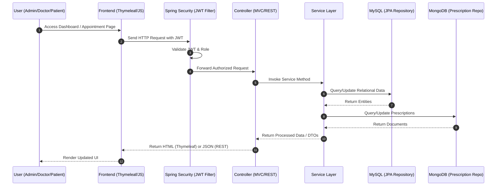
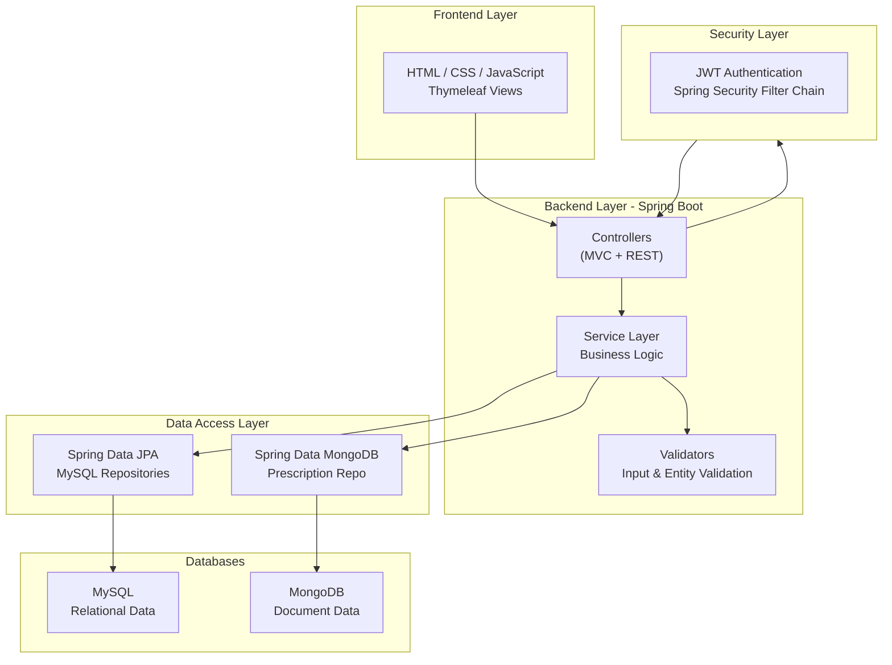

## Architecture summary

This Spring Boot application uses both MVC and REST controllers. Thymeleaf templates are used for the Admin and Doctor dashboards, while REST APIs serve all other modules. The application interacts with two databases—MySQL (for patient, doctor, appointment, and admin data) and MongoDB (for prescriptions). All controllers route requests through a common service layer, which in turn delegates to the appropriate repositories. MySQL uses JPA entities while MongoDB uses document models.

## Flow of Data and Control

1. **User accesses AdminDashboard or Appointment pages.**  
   - The user interacts with the system through HTML/CSS/JS pages rendered by Thymeleaf or updated via REST API calls.
   - Based on the user’s role (Admin, Doctor, Patient), the correct dashboard or page is displayed.

2. **The action is routed to the appropriate Thymeleaf or REST controller.**  
   - MVC controllers handle page requests such as `/admin/dashboard` or `/appointments/view`.
   - REST controllers handle API requests such as `/api/appointments` or `/api/patients`.
   - Spring Security intercepts the request first, validates the JWT, and checks role permissions.

3. **The controller calls the service layer.**  
   - Controllers remain thin and delegate all business logic to service classes.
   - The service layer performs validation, authorization checks, and orchestrates interactions between repositories.

4. **The service layer interacts with repositories to access the databases.**  
   - **MySQL (Relational):** Spring Data JPA repositories handle Users, Doctors, Patients, and Appointments.
   - **MongoDB (Document):** Spring Data MongoDB repositories handle Prescriptions and other flexible medical documents.
   - Services may combine data from both databases when needed.

5. **Repositories perform CRUD operations and return entities or DTOs.**  
   - JPA repositories return relational entities with mapped relationships.
   - MongoDB repositories return document objects for prescriptions.
   - Services may convert entities into DTOs for cleaner API responses.

6. **The service layer returns processed data back to the controller.**  
   - Business rules (e.g., appointment availability, doctor assignment) are applied here.
   - Data is filtered based on the user’s role and permissions.

7. **The controller prepares the response.**  
   - **MVC controllers:** Add data to the model and return a Thymeleaf template.
   - **REST controllers:** Serialize data into JSON and return it to the frontend.

8. **The frontend updates the UI.**  
   - Thymeleaf renders dynamic HTML pages for dashboards and lists.
   - JavaScript fetch calls update tables, forms, and modals without full page reloads.
   - JWT is stored in localStorage or cookies and sent with each API request.

9. **User sees updated information and continues interacting with the system.**  
   - The cycle repeats as the user navigates, schedules appointments, views records, or manages clinic data.


# Sequence Diagram (ASCII) — Smart Clinic Management System




```
                 Smart Clinic Management System - Sequence Diagram
                 -------------------------------------------------

 User
  |
  | 1. Access Dashboard / Appointment Page
  v
+------------------+
|   Frontend (UI)  |
+------------------+
          |
          | 2. Send HTTP Request with JWT
          v
+---------------------------+
| Spring Security (JWT)    |
|  - Validate Token        |
|  - Check Role            |
+---------------------------+
          |
          | 3. Forward Authorized Request
          v
+---------------------------+
|     Controller (MVC/REST) |
+---------------------------+
          |
          | 4. Call Service Layer
          v
+---------------------------+
|       Service Layer       |
|  - Business Logic         |
|  - Validation             |
+---------------------------+
      /            \
     /              \
    v                v
+-----------+    +----------------+
| MySQL DB  |    | MongoDB (Docs) |
| (JPA Repo)|    | Prescriptions  |
+-----------+    +----------------+
     |                |
     | 5. Return Data |
     \________________/
          |
          | 6. Return Processed Data (DTOs)
          v
+---------------------------+
|     Controller            |
+---------------------------+
          |
          | 7. Return HTML or JSON
          v
+------------------+
|   Frontend (UI)  |
+------------------+
          |
          | 8. Render Updated UI
          v
        User
```


# ASCII Component Diagram — Smart Clinic Management System




```
                         +--------------------------------------+
                         |        Frontend (UI Layer)           |
                         |--------------------------------------|
                         |  - HTML / CSS / JavaScript           |
                         |  - Thymeleaf Templates               |
                         +------------------+-------------------+
                                            |
                                            | HTTP Requests (JWT)
                                            v
+----------------------------------------------------------------------------------+
|                           Backend (Spring Boot Application)                      |
|----------------------------------------------------------------------------------|
|                                                                                  |
|   +----------------------+        +----------------------+        +--------------+|
|   |  Security Layer     |        |   Controllers        |        |  Validators  ||
|   |----------------------|        |----------------------|        |--------------||
|   | - JWT Filter        |<------>| - MVC Controllers    |<------>| - Input/DTO  ||
|   | - Role Checking     |        | - REST Controllers   |        |   Validation ||
|   +----------------------+        +----------------------+        +--------------+|
|                 |                               |                           |
|                 |                               v                           |
|                 |                     +----------------------+              |
|                 |                     |   Service Layer      |              |
|                 |                     |----------------------|              |
|                 |                     | - Business Logic     |              |
|                 |                     | - Authorization      |              |
|                 |                     +----------+-----------+              |
|                 |                                |                          |
|                 |                                |                          |
|                 |                                v                          |
|   +---------------------------+      +---------------------------+          |
|   |  JPA Repository Layer     |      | MongoDB Repository Layer  |          |
|   |---------------------------|      |---------------------------|          |
|   | - Users / Doctors         |      | - Prescriptions           |          |
|   | - Patients / Appointments |      | - Medical Documents       |          |
|   +-------------+-------------+      +-------------+-------------+          |
|                 |                                |                          |
+-----------------+--------------------------------+--------------------------+
                  |                                |
                  v                                v
        +-------------------+            +----------------------+
        |     MySQL DB      |            |     MongoDB          |
        |-------------------|            |----------------------|
        | Relational Data   |            | Document Data        |
        | (Users, Doctors,  |            | (Prescriptions, etc) |
        | Patients, Appts)  |            |                      |
        +-------------------+            +----------------------+
```


# ASCII Architecture Overview — Smart Clinic Management System

```
                           SMART CLINIC MANAGEMENT SYSTEM
                           =================================

                                   +----------------+
                                   |     Users      |
                                   |----------------|
                                   | Admin          |
                                   | Doctor         |
                                   | Patient        |
                                   +--------+-------+
                                            |
                                            | HTTP Requests (JWT)
                                            v

+--------------------------------------------------------------------------------------+
|                               FRONTEND (Presentation Layer)                          |
|--------------------------------------------------------------------------------------|
|  - HTML / CSS / JavaScript                                                           |
|  - Thymeleaf Templates                                                               |
|  - Fetch API / AJAX                                                                  |
|                                                                                      |
|  Responsibilities:                                                                   |
|   * Render dashboards and forms                                                      |
|   * Send authenticated requests with JWT                                             |
|   * Display data returned by backend                                                 |
+--------------------------------------+-----------------------------------------------+
                                           |
                                           | Routes / API Calls
                                           v

+--------------------------------------------------------------------------------------+
|                               BACKEND (Spring Boot)                                  |
|--------------------------------------------------------------------------------------|
|                                                                                      |
|  +-----------------------+     +-----------------------+     +---------------------+ |
|  |   Security Layer      |     |     Controllers       |     |     Validators      | |
|  |-----------------------|     |-----------------------|     |---------------------| |
|  | - JWT Auth Filter     |<--->| - MVC Controllers     |<--->| - Input Validation  | |
|  | - Role Authorization  |     | - REST Controllers    |     | - DTO Validation    | |
|  +-----------------------+     +-----------------------+     +---------------------+ |
|                 |                             |                             |       |
|                 |                             v                             |       |
|                 |                   +-----------------------+                |       |
|                 |                   |     Service Layer     |                |       |
|                 |                   |-----------------------|                |       |
|                 |                   | - Business Logic      |                |       |
|                 |                   | - Orchestration       |                |       |
|                 |                   +-----------+-----------+                |       |
|                 |                               |                            |       |
|                 |                               |                            |       |
|                 |                               v                            |       |
|  +-----------------------------+     +-----------------------------+          |       |
|  |   JPA Repository Layer      |     | MongoDB Repository Layer    |          |       |
|  |-----------------------------|     |-----------------------------|          |       |
|  | - Users / Doctors           |     | - Prescriptions             |          |       |
|  | - Patients / Appointments   |     | - Medical Documents         |          |       |
|  +--------------+--------------+     +--------------+--------------+          |       |
|                 |                               |                            |       |
+-----------------+-------------------------------+----------------------------+-------+
                  |                               |
                  v                               v

        +------------------------+        +---------------------------+
        |       MySQL DB         |        |         MongoDB           |
        |------------------------|        |---------------------------|
        | Relational Entities    |        | Document Collections      |
        | - Users                |        | - Prescriptions           |
        | - Doctors              |        | - Notes / History         |
        | - Patients             |        |                           |
        | - Appointments         |        |                           |
        +------------------------+        +---------------------------+

```
